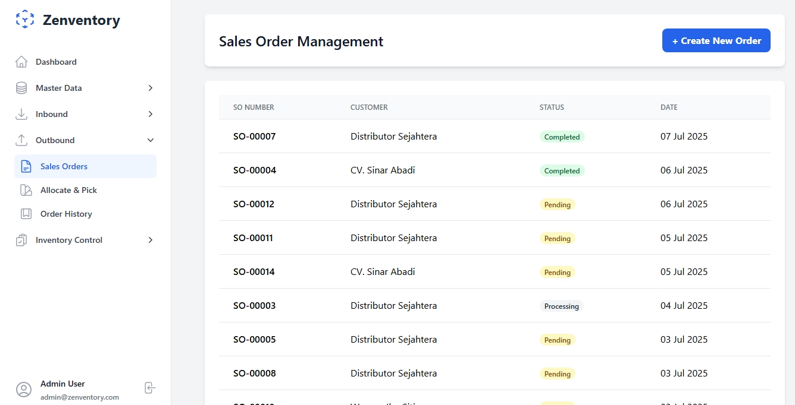

# Zenventory - Sistem Manajemen Gudang Modern

Zenventory adalah **sistem manajemen gudang (WMS)** yang dirancang untuk memberikan presisi dan efisiensi dalam operasional gudang Anda. Dibangun dengan tumpukan teknologi modern, Zenventory mengimplementasikan metode pelacakan inventaris canggih seperti **FIFO (First-In, First-Out)** dan **FEFO (First-Expired, First-Out)** untuk memastikan kontrol kualitas dan akurasi stok yang superior.

Aplikasi ini sangat cocok untuk **Usaha Kecil Menengah (UKM)** dan distributor yang ingin beralih dari manajemen inventaris manual ke sistem yang lebih terstruktur, otomatis, dan dapat diandalkan tanpa memerlukan investasi besar pada perangkat keras khusus.


---

## 🚀 Fitur Unggulan

Zenventory dilengkapi dengan berbagai fitur canggih untuk mengoptimalkan setiap aspek operasional gudang Anda:

* **Dashboard Analitis**: Dapatkan ringkasan visual instan mengenai KPI gudang, termasuk status pesanan, level stok, dan aktivitas inbound/outbound harian.
* **Manajemen Master Data Terpusat**:
    * **Produk**: Kelola data produk lengkap dengan SKU, nama, dan deskripsi.
    * **Lokasi Gudang**: Definisikan topologi gudang Anda secara hierarkis (`Zona > Lorong > Rak > Bin`) untuk penempatan dan pengambilan barang yang presisi.
* **Proses Inbound (Penerimaan Barang) Efisien**:
    * Catat penerimaan barang dengan mudah dan hasilkan **License Plate Number (LPN)** unik untuk setiap *batch* guna pelacakan yang akurat.
    * Lihat riwayat lengkap semua barang yang masuk untuk transparansi penuh.
* **Proses Outbound (Pengeluaran Barang) Otomatis**:
    * Kelola pesanan penjualan (*Sales Orders*) dari pelanggan.
    * Sistem **alokasi stok cerdas** secara otomatis merekomendasikan LPN mana yang harus diambil berdasarkan aturan FIFO/FEFO untuk mengurangi pemborosan.
    * Hasilkan *picklist* yang teroptimasi untuk mempercepat proses pengambilan barang di gudang.
* **Kontrol Inventaris Superior**:
    * Lacak riwayat pergerakan setiap LPN dari penerimaan hingga pengiriman.
    * Lakukan **Cycle Count** untuk menjaga akurasi data stok dengan penghitungan fisik secara berkala.
    * Sesuaikan kuantitas stok dengan mudah jika terjadi ketidaksesuaian melalui fitur **Stock Adjustment**.
* **Manajemen Retur**: Kelola barang yang dikembalikan oleh pelanggan dan tentukan apakah akan di-*restock* atau dihapus dari inventaris.
* **Manajemen Pengguna & Hak Akses**: Atur peran pengguna (Admin, Manager, Staff) dengan hak akses yang dapat disesuaikan untuk menjaga keamanan data.

---

## 🛠️ Tumpukan Teknologi

* **Backend**: Laravel 11
* **Frontend**: Livewire 3 & Alpine.js
* **UI Framework**: Tailwind CSS
* **Database**: MySQL / MariaDB
* **Pustaka Tambahan**:
    * `livewire/livewire`: Untuk komponen frontend yang dinamis.
    * `spatie/laravel-permission`: Untuk manajemen peran dan hak akses.
    * `blade-ui-kit/blade-heroicons`: Untuk ikon antarmuka yang modern.
    * `sweetalert2`: Untuk notifikasi dan konfirmasi yang interaktif.
    * `apexcharts`: Untuk visualisasi data dan laporan.

---

## 🖼️ Dokumentasi Visual Aplikasi

Berikut adalah tangkapan layar dari beberapa modul utama di dalam Zenventory:

| Modul | Tampilan Antarmuka |
| :------------------------- | :---------------------------------------------------------- |
| **Manajemen Produk** |  |
| **Manajemen Sales Order** | |
| **Penerimaan Barang (Inbound)** |  |
| **Riwayat Inbound** |  |
| **Alokasi & Picking (Outbound)** |  |
| **Riwayat Outbound** |  |
| **Pelacakan LPN** |  |
| **Detail Stok per Produk** |  |
| **Penyesuaian Stok** |  |
| **Cycle Counting** |  |

---

## ⚙️ Instalasi dan Menjalankan Aplikasi

Ikuti langkah-langkah berikut untuk menjalankan Zenventory di lingkungan lokal Anda.

### Prasyarat

* PHP 8.2 atau lebih tinggi
* Composer
* Node.js & NPM
* Database (MySQL atau MariaDB)

### Langkah-langkah Instalasi

1.  **Clone Repositori**
    ```bash
    git clone [https://github.com/dewandra/zenventory.git](https://github.com/dewandra/zenventory.git)
    cd zenventory
    ```

2.  **Instal Dependensi PHP**
    ```bash
    composer install
    ```

3.  **Instal Dependensi JavaScript**
    ```bash
    npm install
    ```

4.  **Buat File Konfigurasi Lingkungan (`.env`)**
    ```bash
    cp .env.example .env
    ```

5.  **Hasilkan Kunci Aplikasi**
    ```bash
    php artisan key:generate
    ```

6.  **Konfigurasi Database**
    Buka file `.env` dan atur koneksi database Anda. Pastikan nama database sudah Anda buat sebelumnya.
    ```env
    DB_CONNECTION=mysql
    DB_HOST=127.0.0.1
    DB_PORT=3306
    DB_DATABASE=zenventory
    DB_USERNAME=root
    DB_PASSWORD=
    ```

7.  **Jalankan Migrasi dan Seeder Database**
    Perintah ini akan membuat semua tabel yang dibutuhkan dan mengisinya dengan data contoh (pengguna admin, produk, lokasi, dll).
    ```bash
    php artisan migrate --seed
    ```

8.  **Jalankan Build Aset Frontend**
    ```bash
    npm run build
    ```

### Menjalankan Server Pengembangan

Buka terminal Anda dan jalankan perintah `dev` yang sudah disediakan untuk menjalankan semua layanan (server PHP, Vite, dan queue worker) secara bersamaan.

```bash
composer run dev